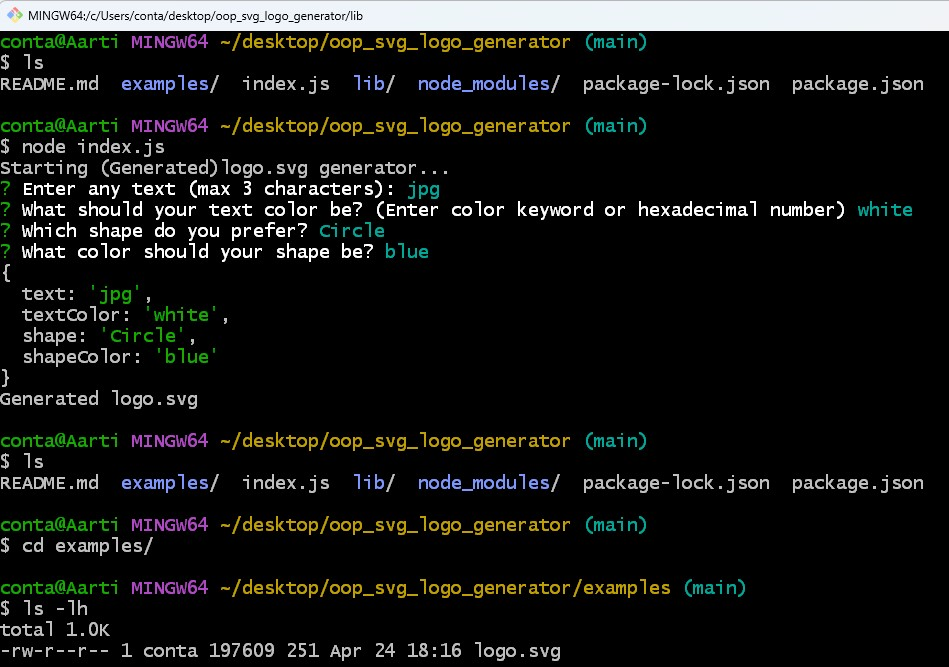
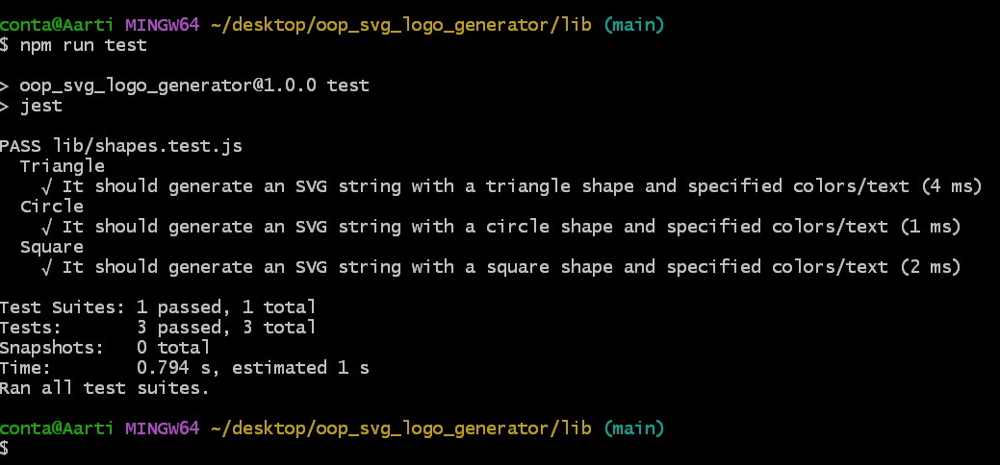
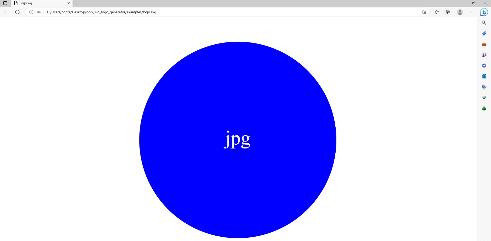

# oop_svg_logo_generator


## Description

[Watch the Walkthrough Video](https://www.youtube.com/watch?v=72Pkb2xO730)
<br>
This application is a Node.js command-line application that takes in user input to generate a logo and save it as an 'svg' file. The application prompts the user using inquire package from NPM to select a color and shape, provide text for the logo from the command line, and saves the generated SVG to the generated '.svg' file.

In the command line, the user is prompted for text (maximum three characters), text color, shape, and shape color. When the user enters all the prompts, an SVG file is created named 'logo.svg', which shows an image of a logo.


<br>
<br>


## Technology Used 

| Technology Used         | Resource URL           | 
| ------------- |:-------------:| 
| HTML    | [https://developer.mozilla.org/en-US/docs/Web/HTML](https://developer.mozilla.org/en-US/docs/Web/HTML) |   
| Git | [https://git-scm.com/](https://git-scm.com/)     |  
| JavaScript | [https://developer.mozilla.org/en-US/docs/Web/JavaScript](https://developer.mozilla.org/en-US/docs/Web/JavaScript) |  
| NodeJs | [https://nodejs.org/en](https://nodejs.org/en) |
| OOP | [https://developer.mozilla.org/en-US/docs/Learn/JavaScript/Objects/Object-oriented_programming](https://developer.mozilla.org/en-US/docs/Learn/JavaScript/Objects/Object-oriented_programming) |
| NPM | [https://www.npmjs.com/](https://www.npmjs.com/) |
| Scalable Vector Graphics-SVG| [https://developer.mozilla.org/en-US/docs/Web/SVG](https://developer.mozilla.org/en-US/docs/Web/SVG) |


<br>


## Table of Contents

* [Application Highlights and Usage](#application-highlights-and-usage)
* [Code Snippets](#code-snippets)
* [Note](#note)
* [Learning Points](#learning-points)
* [Author Info](#author-info)
* [Credits](#credits)

<br>


## Application Highlights and Usage
<br>

1. Below is the image of how the inquirer prompt works when lodged in the command line: 
<br>
<br>




<br>
<br>
2. Below is the image of how all the three Jest tests have passed in the command line: 
<br>
<br>


<br>
<br>

3. Below is the image of the generated logo when opened in the browser:
<br>
<br>


<br>
<br>


## Code Snippets

<br>

The following code snippet shows a class named "Triangle" that has a constructor method to initialize the instance properties text, textColor, and shapeColor. It also has a method named render:

```javascript

class Triangle {
    constructor(text, textColor, shapeColor) {
        this.text = text;
        this.textColor = textColor;
        this.shapeColor = shapeColor;
    }

    // renders a triangle with the specified colors and text
    render() {
        const points = "150,18 244,182 56,182";
        const text = `<text x="50%" y="50%" dominant-baseline="middle" text-anchor="middle" fill="${this.textColor}">${this.text}</text>`;
        return `<svg viewBox="0 0 300 200" xmlns="http://www.w3.org/2000/svg">
              <polygon points="${points}" fill="${this.shapeColor}" />
              ${text}
            </svg>`;
    }


}

```

<br>
<br>


The below snippet shows a Jest test suite that tests the behavior of the Triangle class in the shapes.js module: 

```javascript
const { Circle, Square, Triangle } = require("./shapes");

describe("Triangle", () => {
  it("It should generate an SVG string with a triangle shape and specified colors/text", () => {
    const triangle = new Triangle("abc", "#FFFFFF", "#000000");
    const rendered = triangle.render();
    expect(rendered).toContain("<polygon");
    expect(rendered).toContain(`fill="#000000"`);
    expect(rendered).toContain(`fill="#FFFFFF"`);
    expect(rendered).toContain("<text");
    expect(rendered).toContain("abc");
  });
});


```

<br>
<br>


# Note

Click on the below link to view an example of the Generated Logo file (Open the logo.svg file in your browser):
<br>
[Link Text](./examples/logo.svg)

<br>
<br>

## Learning Points 

   I learned the following skills while doing this project:
<br>
- Java script basics (variables,functions, arrays, for-loops, if-else etc)
- How to create a dynamic logo using the command line
- Basics of NodeJs server and related functions
- How to write switch case statements and fs.writefile functions
- Using the let and const variables
- Making test cases using Jest and OOP
- How to use scalable vector graphics-svg to create a simple logo

<br>
<br>

## Author Info

### Aarti Contractor


- Portfolio: https://aarticontractor.github.io/aarticontractor_portfolio/
- Linkedin: https://www.linkedin.com/in/aarti-contractor/
- Github: https://github.com/aarticontractor

<br>

## Credits

- https://developer.mozilla.org/en-US/docs/Web/JavaScript
- https://cloudconvert.com/webm-to-gif
- https://nodejs.org/en
- https://www.npmjs.com/package/inquirer
- https://www.npmjs.com/package/jest
- https://developer.mozilla.org/en-US/docs/Learn/JavaScript/Objects/Object-oriented_programming
- https://developer.mozilla.org/en-US/docs/Web/SVG


<br>

© 2023 edX Boot Camps LLC. Confidential and Proprietary. All Rights Reserved.